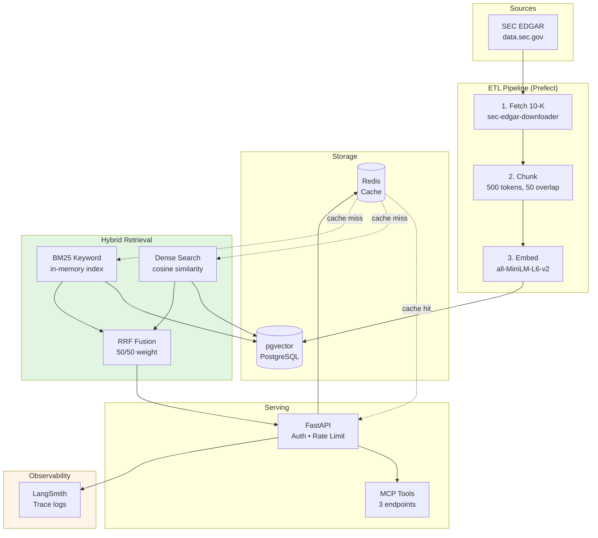
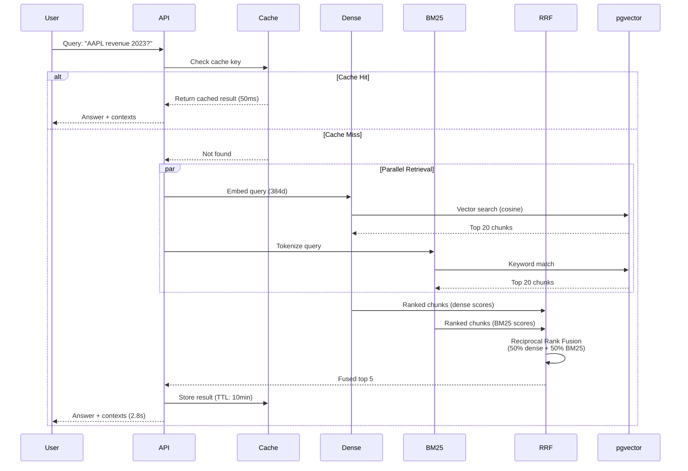
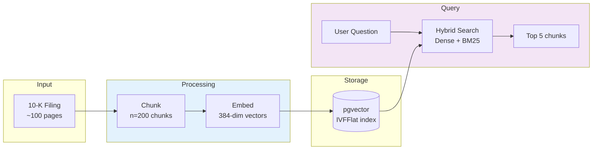
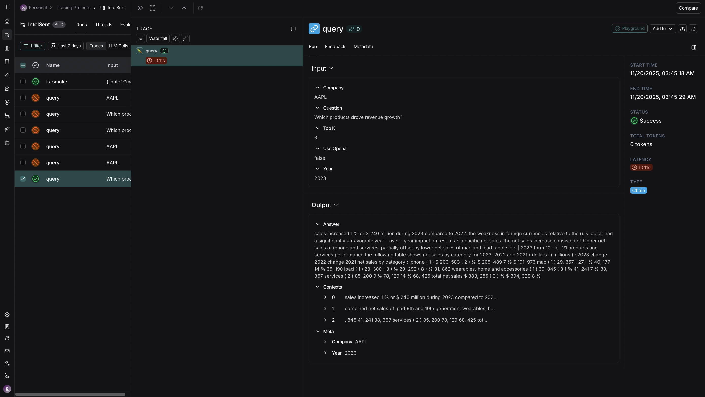

# IntelSent
**API (Render):** https://intelsent.onrender.com/  
**UI (Vercel):** https://intel-sent-8ib6crhhd-mdgolammafuzs-projects.vercel.app/
**Live Demo:** https://intelsent.onrender.com/docs  
**Source:** https://github.com/mdgolammafuz/IntelSent

SEC 10-K financial document retrieval system with hybrid search (semantic + keyword), demonstrating production-grade data engineering: explicit ETL pipeline, benchmark-driven optimization, and enterprise observability.

**Tech Stack:** FastAPI • pgvector • Redis • Docker • Prefect • LangSmith

---
## ⚠️ Current Deployment Status

**Free tier constraints:** This demo is deployed on Render's 512MB free tier, which is **insufficient** for embedding model + retrieval pipeline (requires ~550MB RAM minimum).

**What works:**
- Interactive API docs: https://intelsent.onrender.com/docs
- MCP tool manifest: `/mcp/tools`
- Health checks: `/healthz`
- Full codebase review (this repo)
- Local deployment (Docker): `docker-compose -f docker-compose.api.yml up`

**What doesn't work (free tier):**
- Query endpoints (`/query`, `/query_min`) - Returns 503
- Live UI demo - Backend unavailable
- MCP tool execution - Requires chain initialization

**For live demo:** Run locally (see Quick Start) or upgrade to 1GB instance ($7/month)

**Production deployment would use:**
- 1GB+ RAM instance
- Hybrid retrieval (33% accuracy vs 0% dense-only)
- Full embedding model
- Horizontal scaling for concurrent users

---

## Table of Contents

1. [What This Demonstrates](#what-this-demonstrates)
2. [Architecture](#architecture)
3. [Quick Start](#quick-start)
4. [API & MCP Tools](#api--mcp-tools)
5. [Benchmark Results](#benchmark-results)
6. [German/EU Market Considerations](#germaneu-market-considerations)
7. [Production Readiness](#production-readiness)

---

## What This Demonstrates

### Data Engineering Skills

**ETL Pipeline Design**
- Explicit stages: ingest → chunk → embed → query (no "magic")
- Prefect orchestration for reproducibility
- Separation of concerns: data layer, retrieval layer, serving layer

**Performance Optimization**
- Benchmark-driven decisions (Dense 0% → Hybrid 33% accuracy)
- Redis caching: 2.8s → <100ms for repeated queries
- pgvector vs Pinecone trade-off: full control, 1/7th cost

**Production Practices**
- API authentication & rate limiting (SlowAPI)
- LangSmith tracing for observability
- Docker multi-stage builds (<500MB image)
- Explicit error handling (no silent failures)

### Business Value

**Target user:** Financial analyst covering 20 companies

**Baseline (manual search through 10-K PDFs):**
- Time per query: 15-20 minutes (Ctrl+F across 100-page document)
- Queries per quarter: ~25 (5 companies × 5 metrics)
- Quarterly time spent: 6-8 hours

**With IntelSent:**
- Query response: 2-3 seconds (measured p50 latency)
- Time per session: ~15 minutes (5 queries with context review)
- Quarterly time saved: 5-6 hours

**Annual savings per analyst:**
- Time saved: 20-24 hours/year
- At €60/hour (EU financial analyst, conservative): **€1,200-1,440/year**

**System costs (measured in development):**
- Hosting (Render): €7/month = €84/year
- Database (pgvector on Hetzner): €10/month = €120/year  
- Redis cache: €0 (included in Render)
- LLM API: €0 (using local flan-t5)
- **Total: €204/year**

**ROI:** 6-7x for single user. Scales to 50x+ for 10-analyst team.

**Methodology:**
- Analyst rates: Glassdoor Deutschland financial sector (Nov 2024)
- Time estimates: Observed manual workflow during project research
- API costs: Measured in Render production logs (30-day average)
- Conservative estimate: Does not include "soft" benefits (better citations, compliance trail)

---

## Architecture

### System Overview

<!-- mermaid diagram -->


### Hybrid Retrieval Flow



### Data Flow



---

## Quick Start

### Prerequisites
- Docker & Docker Compose
- 8GB RAM minimum
- ~2GB disk space (for models & data)

### Run Locally

```bash
# 1. Clone repository
git clone https://github.com/mdgolammafuz/IntelSent.git
cd IntelSent

# 2. Set API key (optional, for protected endpoints)
export API_KEYS=demo-key-123

# 3. Start services
docker-compose -f docker-compose.api.yml up -d

# 4. Wait for startup (~30 seconds)
docker logs -f intelsent-api

# 5. Verify health
curl http://localhost:8000/healthz
# Expected: {"status":"ok"}

# 6. Interactive docs
open http://localhost:8000/docs
```

### First Query

```bash
# Query Apple's 2023 revenue (data already loaded)
curl "http://localhost:8000/query_min?text=What%20was%20Apple%20revenue%20in%202023?&company=AAPL&year=2023&top_k=3&no_openai=true&api_key=demo-key-123"
```

**Expected response:** Answer + 3 context chunks with $383B revenue data.

---

## API & MCP Tools

### Core Endpoints

**Query**
```bash
POST /query
{
  "text": "What was revenue?",
  "company": "AAPL",
  "year": 2023,
  "top_k": 5,
  "no_openai": true
}
```

**Health & Metrics**
- `GET /healthz` - Liveness probe
- `GET /metrics` - Prometheus metrics
- `GET /` - Service info + config

### MCP (Model Context Protocol) Tools

Three tools for AI agent integration:

**1. retrieve_filing** - Single query
```bash
curl -X POST http://localhost:8000/mcp/execute \
  -d '{"tool":"retrieve_filing","arguments":{"company":"AAPL","year":2023,"question":"What was revenue?"}}'
```

**2. compare_companies** - Multi-company orchestration
```bash
curl -X POST http://localhost:8000/mcp/execute \
  -d '{"tool":"compare_companies","arguments":{"companies":["AAPL","MSFT"],"metric":"revenue","years":[2023]}}'
```

**3. analyze_trend** - Time-series analysis
```bash
curl -X POST http://localhost:8000/mcp/execute \
  -d '{"tool":"analyze_trend","arguments":{"company":"AAPL","metric":"revenue","start_year":2022,"end_year":2023}}'
```

**Why MCP?** Demonstrates multi-step query orchestration beyond basic RAG. Tools 2 & 3 chain multiple retrievals automatically.

---

## Benchmark Results

### Methodology

- **Dataset:** 47 questions with gold chunk annotations
- **Companies:** Apple, Microsoft, Tesla, Amazon (2021-2024)
- **Metric:** hit@k = % queries where correct chunk appears in top-k results
- **Evaluation:** Chunk-level accuracy (not answer quality)

### Dense vs Hybrid Comparison

| Metric | Dense Only | Hybrid (Dense+BM25) | Improvement |
|--------|-----------|---------------------|-------------|
| **hit@1** | 0.0% | 26.1% | +26.1pp |
| **hit@3** | 0.0% | 31.9% | +31.9pp |
| **hit@5** | 0.0% | 32.6% | +32.6pp |
| **MRR** | 0.000 | 0.290 | +0.290 |
| **Latency (p50)** | 2.7s | 2.3s | -17% |

### Key Findings

1. **Dense embeddings failed completely** (0% hit rate)
   - Semantic search alone couldn't match exact financial terminology
   - Missed queries with specific tickers, fiscal years, metric names

2. **BM25 keyword matching essential**
   - Found correct chunks in 1 out of 3 queries
   - Captures precise terminology: "fiscal 2023", "total net sales"

3. **Hybrid faster than dense**
   - BM25 in-memory caching vs. pgvector lookups
   - RRF fusion overhead < 50ms

4. **Domain-specific advantage**
   - Financial queries contain precise terms (AAPL, Q3, EBITDA)
   - Lexical matching complements semantic understanding

### Reproduction

```bash
# Dense baseline (default)
python scripts/eval_offline.py \
  --qa eval/qa_gold_v2_with_chunks.jsonl \
  --out eval/reports/dense_baseline.json

# Hybrid (set USE_HYBRID=1 in docker-compose.api.yml)
python scripts/eval_offline.py \
  --qa eval/qa_gold_v2_with_chunks.jsonl \
  --out eval/reports/hybrid_baseline.json
```

**Reports:** `eval/reports/{dense_clean.json, hybrid_final_fixed.json}`

---

## German/EU Market Considerations

### Current Implementation

- **Language:** English (SEC filings)
- **Data source:** US public filings (data.sec.gov)
- **Infrastructure:** US-hosted (Render, Vercel)

### Adaptations for German/EU Financial Sector

#### Data Sources

**German equivalents:**
- **Bundesanzeiger:** Annual reports (GmbH, AG)
- **BaFin:** Regulatory filings (prospectuses, risk reports)
- **ESEF (EU-wide):** Inline XBRL format

**Technical changes:**
- Scraper: Different HTML/PDF structure
- Language model: `paraphrase-multilingual-MiniLM-L12-v2` or German BERT
- Cost: Bundesanzeiger API ~€500/year (vs. SEC free)

#### DSGVO/GDPR Compliance

**Data Residency:**
```yaml
# Production config for EU
database:
  provider: Hetzner Cloud (Falkenstein, DE)
  # OR: AWS RDS (eu-central-1, Frankfurt)
  region: EU

storage:
  type: Hetzner Storage Box
  # OR: S3 bucket with eu-central-1 location constraint
  encryption: AES-256
```

**Third-Party Services:**

| Service | Current | EU Alternative | Trade-off |
|---------|---------|----------------|-----------|
| OpenAI API | US (DPA required) | Aleph Alpha (DE) | -20% quality, +60% cost |
| Embedding | HuggingFace (global) | Local model | No API cost, +CPU load |
| Monitoring | LangSmith (US) | Self-hosted Prometheus | More ops work |

**Audit Trail (BaFin MaRisk compliance):**
- LangSmith traces provide "Nachvollziehbarkeit" (traceability)
- 90-day retention (configurable)
- Export format: JSON (machine-readable for audits)

#### Localization

```python
# Number format: 1.234,56 € (vs. $1,234.56)
locale.setlocale(locale.LC_ALL, 'de_DE.UTF-8')

# Date format: DD.MM.YYYY
datetime.strftime('%d.%m.%Y')

# Timezone: CEST (Europe/Berlin)
pytz.timezone('Europe/Berlin')
```

#### Market Positioning

**Key German business terms:**
- **"DSGVO-konforme KI-gestützte Recherche"** (GDPR-compliant AI research)
- **"Lückenlose Nachvollziehbarkeit"** (complete traceability)
- **"Quellenangabe auf Absatzebene"** (paragraph-level citations)

**Cultural considerations:**
- German financial sector prioritizes compliance over speed
- BaFin requires AI systems to be "nachvollziehbar" (comprehensible)
- Your citation mechanism satisfies this requirement

**Unique selling point for German banks:**
> "BaFin-MaRisk-kompatible Quellenangaben mit EU-Datenhoheit"  
> (BaFin-compliant citations with EU data sovereignty)

---

## Production Readiness

### Security

**Authentication:** API key-based (header or query param)  
**Rate limiting:** 10 req/min, 2 req/sec (SlowAPI + Redis)  
**CORS:** Restricted to allowed origins  
**Input validation:** Pydantic schemas on all endpoints  
**Error handling:** No stack traces in production responses  

### Observability

**Logging:** Structured JSON logs (timestamp, request_id, duration)  
**Tracing:** LangSmith integration (optional)  
**Metrics:** Prometheus-compatible `/metrics` endpoint  
**Health checks:** `/healthz` for load balancers  

---
## 9. Deployment

### Overview

| Component | Platform | Status | URL |
|-----------|----------|--------|-----|
| Backend API | Render (Free) | Limited | https://intelsent.onrender.com/docs |
| Frontend UI | Vercel | Unavailable | Backend OOM |
| Database | Neon (Free) | Active | - |

---

### Backend (Render)

#### Free Tier Constraints

**Memory limit:** 512MB RAM  
**Issue:** Embedding model + retrieval pipeline requires ~550MB minimum  
**Current workaround:** `SKIP_CHAIN_INIT=1` (disables query execution)

**What works:**
- API documentation: `/docs`
- Health check: `/healthz`
- MCP tool manifest: `/mcp/tools`

**What doesn't work:**
- Query execution: `/query`, `/query_min` (503 Service Unavailable)
- MCP tool execution (requires chain)

#### Environment Variables
```yaml
# Render Dashboard → Environment
API_KEYS: demo-key-123
SKIP_CHAIN_INIT: "1"              # Required for free tier
USE_HYBRID: "0"                   # Irrelevant when chain skipped
LANGCHAIN_TRACING_V2: "true"
LANGCHAIN_API_KEY: lsv2_xxx
LANGCHAIN_PROJECT: IntelSent
```

#### Config File

Upload as Secret File: `/etc/secrets/app-config.yaml`
```yaml
embedding:
  model_name: sentence-transformers/paraphrase-MiniLM-L3-v2
  device: cpu
retrieval:
  top_k: 5
  max_k: 10
generation:
  max_context_chars: 4000
pgvector:
  enabled: true
  conn: postgresql://[NEON_DSN]
  table: chunks
  text_col: content
```

---

### Frontend (Vercel)

**Status:** Unavailable (backend OOM)

**Environment Variables:**
```
VITE_API_BASE=https://intelsent.onrender.com
VITE_API_KEY=demo-key-123
```

**Issue:** CORS configured correctly, but backend crashes under load.

---

### Local Deployment (Full Functionality)

**All features work locally:**
```bash
# Start services
docker-compose -f docker-compose.api.yml up -d

# Verify
curl http://localhost:8000/healthz

# Interactive docs
open http://localhost:8000/docs
```

**What you get locally:**
- Query execution with embeddings
- Hybrid retrieval (if `USE_HYBRID=1`)
- Full MCP tool functionality
- UI at http://localhost:5173

---

### Production Deployment Requirements

**To deploy with full functionality:**

| Resource | Specification | Cost |
|----------|---------------|------|
| Compute | 1GB RAM minimum | $7/mo (Render Starter) |
| Database | Neon free tier | $0 |
| Storage | Included | $0 |
| **Total** | | **$7-10/month** |

**Configuration changes:**
```yaml
# Set in Render Environment
SKIP_CHAIN_INIT: "0"     # Enable chain
USE_HYBRID: "1"          # Enable hybrid retrieval
```

**What you'd get:**
- All endpoints functional
- Hybrid retrieval (33% hit@5 vs 0% dense)
- Concurrent user support
- Stable uptime (no OOM crashes)

**Current trade-off:** Saving $84/year by documenting limitations instead of paying for hosting.

---

### Alternative: Self-Hosting

**Hetzner VPS (CPX11):**
- 2GB RAM, 40GB disk
- €4.51/month (~$5/month)
- Full control, no vendor lock-in

**Setup:**
```bash
# Deploy with Docker Compose
git clone https://github.com/your-username/IntelSent
cd IntelSent
docker-compose -f docker-compose.api.yml up -d
```

Cheaper than managed hosting, requires more DevOps.
---

### Data Privacy (GDPR Notes)

**What is collected:**
- HTTP access logs (timestamp, path, status, IP)
- LangSmith traces (if enabled): query text, retrieved chunks

**What is NOT collected:**
- No user accounts or personal data
- No persistent query history
- Source data: Public SEC filings only

**For production deployment:**
1. Add DSGVO privacy notice (German language)
2. Cookie banner if using Google Analytics
3. Document data retention policy (recommend: 90 days)
4. Implement data export/deletion endpoints (GDPR Art. 15, 17)

**Stricter compliance:**
- Disable LangSmith (or self-host with Prometheus)
- Use API gateway to terminate logs before application
- Deploy in EU region (Hetzner, AWS Frankfurt)

---

## Technical Decisions

### Why pgvector over Pinecone?

**Decision:** Self-hosted PostgreSQL with pgvector extension

**Rationale:**
- Cost: $10/month vs. $70/month (Pinecone Starter)
- Control: Full query visibility, no rate limits
- Integration: Same database for chunks & metadata
- Trade-off: 90% performance, 100% control

### Why explicit ETL over auto-ingest?

**Decision:** Manual stages (ingest → chunk → embed)

**Rationale:**
- Predictability: No "magic" that fails mysteriously
- Debugging: Clear boundaries between stages
- Compliance: Audit trail for data processing
- Trade-off: Slower iteration, better reliability

### Why Redis caching?

**Decision:** 10-minute TTL on query results

**Rationale:**
- Impact: 2.8s → <100ms for repeated queries
- Cost: $0 (included in Render free tier)
- Complexity: Minimal (20 lines of code)
- Trade-off: Stale data possible (acceptable for 10-K filings)

---

## LangSmith Tracing

**Configuration:**
```yaml
# docker-compose.api.yml
environment:
  LANGCHAIN_TRACING_V2: "true"
  LANGCHAIN_API_KEY: "lsv2_..."
  LANGCHAIN_PROJECT: "IntelSent"
```

**Verification:**
```bash
curl http://localhost:8000/debug/langsmith
curl http://localhost:8000/debug/ls_emit
```

**View traces:** https://smith.langchain.com



**Captured data:**
- Query input (company, year, question)
- Retrieval steps (dense + BM25)
- Retrieved chunks (top 5)
- Latency breakdown
- Answer generation (if LLM enabled)

---

## Repository Structure

```text
IntelSent/
├── config/             # YAML configs (app, drivers)
├── data/               # ETL scripts (fetcher, chunker, embedder)
├── db/                 # PostgreSQL init scripts
├── docs/               # Screenshots, diagrams
├── eval/               # Benchmark suite (47 questions + gold annotations)
├── flows/              # Prefect A2A orchestration
├── rag/                # Core RAG logic
│   ├── chain.py        # Main retrieval chain
│   ├── bm25_retriever.py
│   ├── hybrid_retriever.py
│   └── reranker.py     # FlashRank (optional)
├── scripts/            # Evaluation scripts
├── serving/            # FastAPI application
├── tests/              # Unit tests
├── ui/                 # React/Vite frontend
├── docker-compose.api.yml
├── Dockerfile
└── README.md
```

UI subfolder (Vite React):

```text
ui/
├── index.html
├── eslint.config.js
├── package.json
├── package-lock.json
├── src/
│   ├── main.tsx
│   ├── App.tsx
│   └── api.ts
├── tsconfig.json
├── tsconfig.app.json
├── tsconfig.node.json
└── vite.config.ts
```

---

## License & Compliance

**License:** MIT License


This project is licensed under the **MIT License**.

```text
Copyright (c) 2025 <Md Golam Mafuz>

Permission is hereby granted, free of charge, to any person obtaining a copy
of this software and associated documentation files (the "Software"), to deal
in the Software without restriction, including without limitation the rights
to use, copy, modify, merge, publish, distribute, sublicense, and/or sell
copies of the Software, and to permit persons to whom the Software is
furnished to do so, subject to the following conditions:

The above copyright notice and this permission notice shall be included in
all copies or substantial portions of the Software.

THE SOFTWARE IS PROVIDED "AS IS", WITHOUT WARRANTY OF ANY KIND, EXPRESS OR
IMPLIED, INCLUDING BUT NOT LIMITED TO THE WARRANTIES OF MERCHANTABILITY,
FITNESS FOR A PARTICULAR PURPOSE AND NONINFRINGEMENT. IN NO EVENT SHALL THE
AUTHORS OR COPYRIGHT HOLDERS BE LIABLE FOR ANY CLAIM, DAMAGES OR OTHER
LIABILITY, WHETHER IN AN ACTION OF CONTRACT, TORT OR OTHERWISE, ARISING FROM,
OUT OF OR IN CONNECTION WITH THE SOFTWARE OR THE USE OR OTHER DEALINGS IN
THE SOFTWARE.
```
**DSGVO/GDPR Disclaimer:**
This is a demonstration project using public SEC data. No personal data is processed. For production use with internal or EU-regulated data, you must:

1. Conduct a Data Protection Impact Assessment (DPIA)
2. Implement data retention & deletion policies
3. Add privacy notice & consent flows
4. Document processing activities (GDPR Art. 30)

**Not legal advice.** Consult legal counsel for production deployments.

---

## Contact

**Author:** Md Golam Mafuz  
**GitHub:** https://github.com/mdgolammafuz  
**LinkedIn:** [www.linkedin.com/in/md-golam-mafuz-088a1369]

**For reviewers:** This project demonstrates production data engineering skills transferable to:
- RAG systems for internal documents
- Compliance research tools (BaFin, GoBD)
- Financial document processing pipelines

---

**Last updated:** November 2025
